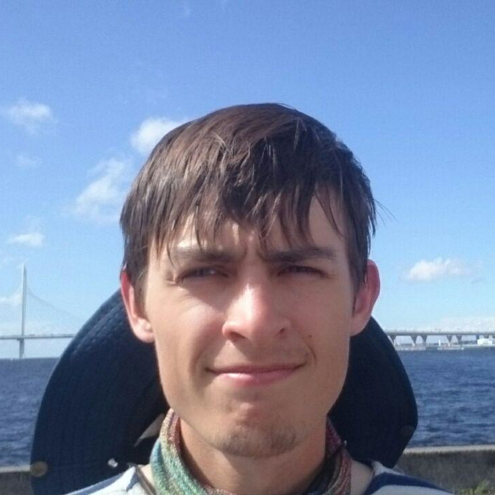

# Hi, my name is Aleksandr Groznykh. 

## These days I make visual art with neural networks. 

## Check [mlart.org](https://mlart.org)

### Here is a list of other links related to me (mainly for people who know me in person):

[github](https://github.com/algroznykh)

[glitch](https://glitch.com/@alg)

[twitter](https://twitter.com/algroznykh)

[ml art experiments](https://t.me/lucidintheskywithdata)

[some talks I liked](https://t.me/talksplus)

[instagram](https://instagram.com/algroznykh)

[hightlights from my year-long sabbatical](http://giraffecrew.tilda.ws/)
